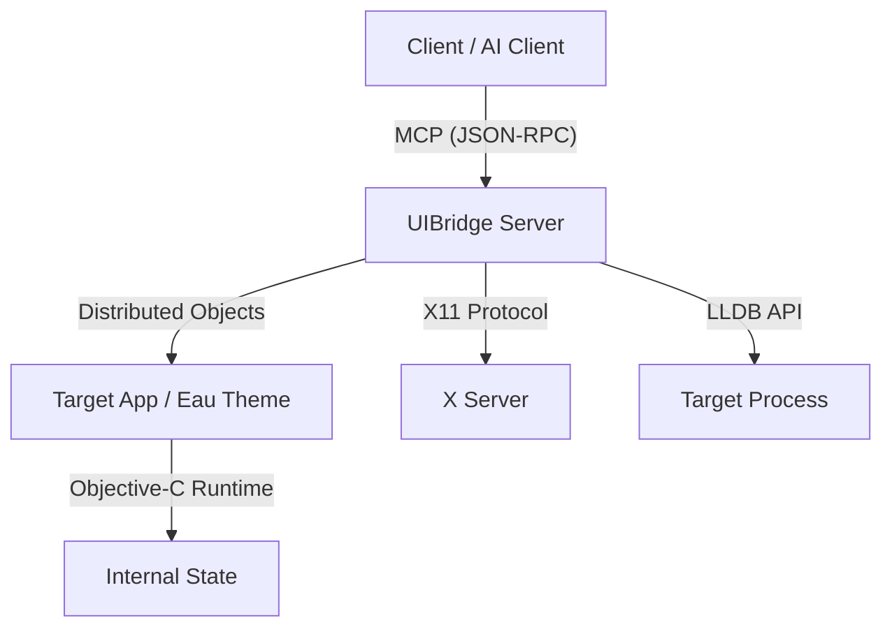

# UIBridge Architecture

UIBridge implements a decoupled architecture that bridges the gap between high-level AI clients and low-level native desktop applications. It leverages the Objective-C runtime's introspection capabilities and the Model Context Protocol (MCP) to provide a programmable interface to GNUstep applications.

## System Overview

The system consists of a **coordinating server** that interacts with applications via the **Eau Theme UIBridge service** using GNUstep Distributed Objects (DO).

## 1. Eau Theme Integration

Modern UIBridge workflows rely on the **Eau theme**, which is the default theme in the Gershwin desktop environment. Eau includes a built-in `UIBridge` service that registers itself via Distributed Objects on application startup.

### Lifecycle and Registration
When a GNUstep application using the Eau theme launches:
- It automatically instantiates a UIBridge provider.
- It registers a unique service name with the `NSConnection` name server, following the pattern `org.gershwin.Gershwin.Theme.UIBridge.<PID>`.
- This eliminates the need for any external components or complex setup.

### Object Registry and Identity
UIBridge uses a **Pointer-as-ID** strategy (`objc:<pointer>`) to uniquely identify Objective-C objects without requiring a complex mapping table.
- **Serialization**: Objects are serialized into JSON descriptors containing their ID, class name, and relevant state (e.g., frame for views, title for windows).
- **Resolution**: The Service resolves incoming IDs back to live objects using standard pointer casting, relying on the stability of objects within the same process session.

### Main Thread Execution
To ensure thread safety with AppKit, the Service executes all state-mutating or UI-querying operations on the application's **Main Thread** using `performSelectorOnMainThread:waitUntilDone:`.

## 2. UIBridge Server

The Server acts as the central coordinator and MCP gateway.

### Connection Management
The Server is responsible for:
- **Application Launching**: Spawning the target process.
- **Discovery**: Scanning for registered `UIBridge` services via standard GNUstep IPC mechanisms.
- **Proxying**: Establishing an `NSConnection` to the application's UIBridge service.

### Tool Implementation
The Server exposes a set of **MCP Tools** that abstract the complexity of the underlying protocol. It handles:
- **Protocol Translation**: Converting JSON-RPC tool calls into Distributed Objects method calls.
- **Error Handling**: Gracefully handling application disconnects or execution failures.

## 3. Extended Integrations

### X11 Support
The Server communicates directly with the X Server to provide capabilities that AppKit cannot easily provide from within the process:
- **Global Window Discovery**: Listing all top-level X11 windows.
- **Input Simulation**: Generating synthetic mouse and keyboard events at exact screen coordinates.

### LLDB Integration
For deep debugging and crash analysis, the Server can attach LLDB to the target process. This allows for:
- **Memory Inspection**: Reading raw memory or registers.
- **Diagnostic Execution**: Running complex debugger scripts to analyze application state.

## 4. Communication Protocol

The `UIBridgeProtocol` defines the contract between the Server and the target application's UIBridge service. It includes methods for:
- **Introspection**: Retrieving root objects and deep object details.
- **Control**: Invoking selectors and triggering menu actions.
- **Serialization**: Ensuring data returned from the application is JSON-safe and properly sanitized.
